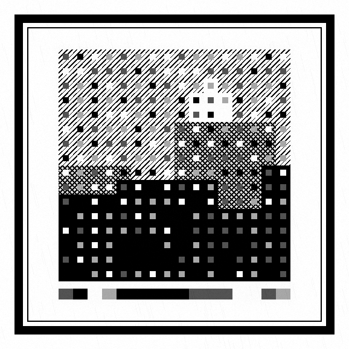

# NoiR Code

A QR-like visual data encoder where the code **is** a noir comic panel. Encode text
into a noir panel; decode a photographed/scanned panel back to text.

Live: <https://noir-code.suncake.xyz>

<p align="center">
  
</p>

## Layout

```
service/python     # reference encode/decode core (NoiR Code lib + CLI) + FastAPI imaging sidecar
service/backend    # Go (Fiber, ports & adapters) gateway API — public, stateless
service/frontend   # React + Vite SPA (encode / decode in the browser)
deploy             # docker-compose for the full stack
docs               # design notes
```

## Architecture

```
browser ──/api/v1──▶ Go gateway (Fiber) ──HTTP──▶ Python imaging sidecar (FastAPI)
                                                   └─▶ noircode core (OpenCV + Reed–Solomon)
```

The gateway owns the public contract, validation, CORS and rate-limiting. The actual
encode/decode work lives in the Python reference implementation (it owns the OpenCV
pipeline), so the gateway proxies to the sidecar rather than re-porting the CV code.
No database/broker — encode/decode is stateless.

## Run the web stack (Docker)

```bash
cd deploy
docker compose up --build
# open http://localhost:8080   (SPA; proxies /api to the gateway)
# Swagger UI: http://localhost:8080/api/v1/docs
```

## Run locally (no Docker)

```bash
# 1. imaging sidecar (port 8001)
cd service/python && uv sync --extra api && NOIRCODE_API_PORT=8001 uv run noir-api &

# 2. Go gateway (port 8000) — points at the sidecar
cd service/backend
NOIRCODE_API_FIBER_PORT=8000 \
NOIRCODE_API_IMAGING_BASE_URL=http://localhost:8001 \
NOIRCODE_API_FIBER_SWAGGER_FILE_PATH=docs/swagger.json \
go run ./cmd/main &

# 3. SPA (port 5173) — vite proxies /api → :8000
cd service/frontend && npm install && npm run dev
```

## API

| Method | Path             | Body                                            | Returns        |
|--------|------------------|-------------------------------------------------|----------------|
| POST   | `/api/v1/encode` | JSON `{text, style?, hatch_data?, adaptive?}`   | `image/png`    |
| POST   | `/api/v1/decode` | multipart `image` file                          | JSON result    |

Capacity: up to **173 bytes** of text (adaptive sizing shrinks the panel for shorter
payloads). OpenAPI 3.1 spec generated by swaggo v2 (`make gen-api-docs`).

## CLI

```bash
cd service/python
uv run noir encode "https://example.com" --out panel.png --style   # adaptive by default
uv run noir decode panel.png
```

See `service/python/README.md` for the format internals and capacity/robustness curve.
